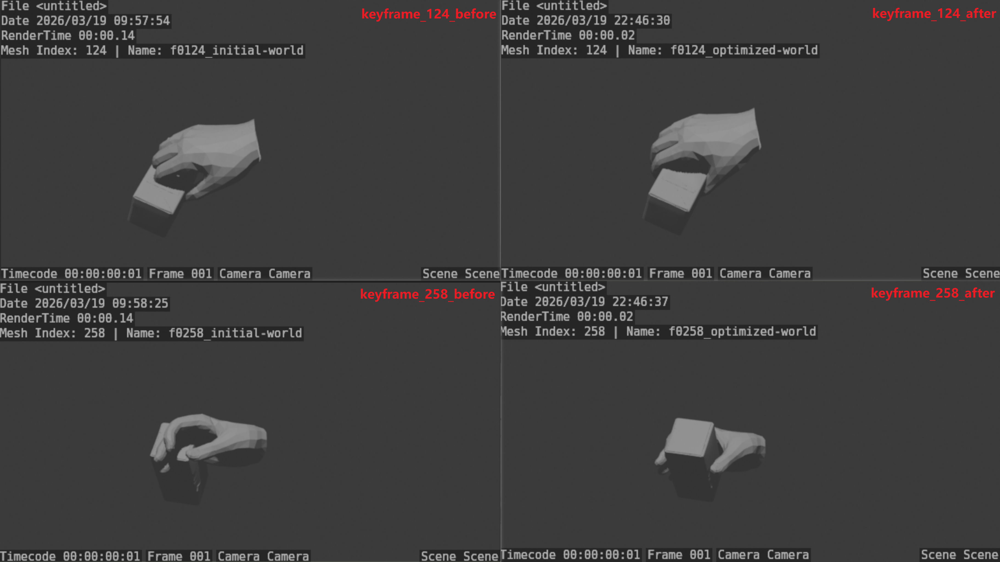
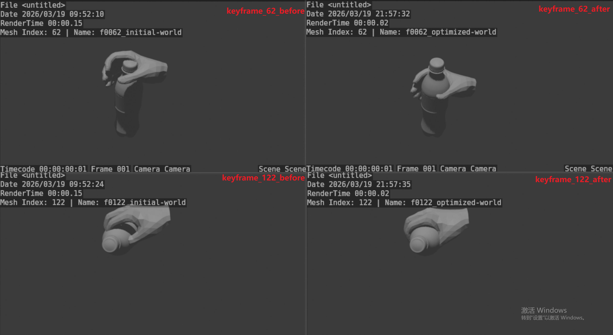

# HOI Optimization Demo

A stage-wise hand-object interaction optimization demo for improving contact plausibility, reducing penetration, and refining hand-object alignment.

## Overview

This repository presents a demo for HOI optimization built on initialized hand-object interaction results.

The pipeline performs stage-wise refinement on interaction sequences and focuses on improving:

- hand-object contact quality
- penetration behavior
- local interaction plausibility
- temporal consistency across frames

## Visual Comparison

## Demo 1: Flip Milk

Representative keyframes from another interaction sequence.  
Left: raw initialization. Right: optimized result.



## Demo 2: Pour Cola 

Representative keyframes from the same sequence.  
Left: raw initialization. Right: optimized result.



### Qualitative improvements

- reduced visible penetration
- better local hand-object alignment
- improved contact plausibility
- smoother interaction refinement across frames

## Video Demo

### Demo 1: Flip Milk

[](assets/videos/demo1_side_by_side.mp4)

### Demo 2: Pour Cola 

[](assets/videos/demo2_side_by_side.mp4)

## Method Highlights

- initialized HOI inputs
- stage-wise optimization
- hand-part-based optimization control
- object-aware geometric losses
- structured outputs for reproducibility and qualitative comparison

### Project Context

This HOI optimization demo is developed as one of the core modules in the broader RoboWheel pipeline for real-world human demonstration understanding and cross-embodiment robotic learning.

For the full project context, please refer to:

Zhang, Yuhong, et al. *RoboWheel: A Data Engine from Real-World Human Demonstrations for Cross-Embodiment Robotic Learning.* arXiv preprint arXiv:2512.02729, 2025.

## Configuration Summary

The pipeline is configured with shared global settings and stage-specific optimization strategies.

### Shared settings

- initialized HOI parameters are used as the optimization input
- MANO segmentation and palm-related configuration are used for part-based control
- each run saves configuration snapshots, logs, visualizations, rendered outputs, and final results

### Stage 0

- performs early palm-centered refinement
- uses multiple alternatives to progressively adjust different variables
- mainly improves initialization quality before stronger interaction constraints are applied

### Stage 1

- first performs coarse alignment-related refinement
- then applies local pose refinement on selected hand regions
- introduces penetration, contact, and smoothness objectives for more interaction-aware optimization

### Design characteristics

- multi-stage refinement
- hand-part-based control
- progressive objective scheduling
- structured and reproducible outputs

## Structure

```text
hoi-optimization-demo/
├── README.md
├── assets/
│   ├── comparisons/
│   │   ├── demo1_flip_milk_keyframes_before_after.png
│   │   ├── demo2_cola_pour_keyframes_before_after.png
│   │   ├── demo1/
│   │   └── demo2/
│   └── videos/
│       ├── demo1_side_by_side.mp4
│       ├── demo2_side_by_side.mp4
│       ├── demo1_side_by_side/
│       └── demo2_side_by_side/
├── docs/
│   ├── method_overview.md
│   └── interview_notes.md
├── src/
│   ├── configs/
│   ├── core/
│   ├── optim/
│   ├── scripts/
│   └── utils/
└── examples/
    ├── sample_output_structure.md
    └── selected_sequence_notes.md
```

## Quick Start

### 1. Browse the qualitative results

- check the keyframe comparison figures in assets/comparisons/
- open the side-by-side videos in assets/videos/

### 2. Inspect the project structure

- `src/configs/`: configuration structure
- `src/core/`: geometry-related and hand/object processing modules
- `src/optim/`: optimization logic
- `src/scripts/`: pipeline scripts
- `src/utils/`: helpers for logging, transforms, and visualization

### 3. Review saved outputs

- Each run is organized with:
  - configuration snapshots
  - optimization logs
  - loss curves
  - optimized results
  - before/after visualization outputs

## TODO

- add a polished pipeline overview figure
- release a cleaner lightweight runnable version if appropriate

## Citation

If you find this repository relevant, please also refer to and cite the broader RoboWheel project:

```bibtex
@article{zhang2025robowheel,
  title={RoboWheel: A Data Engine from Real-World Human Demonstrations for Cross-Embodiment Robotic Learning},
  author={Zhang, Yuhong and others},
  journal={arXiv preprint arXiv:2512.02729},
  year={2025}
}
```

## Contact

Email: aura_feng01@163.com
